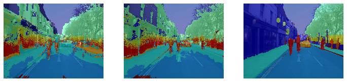

# Semantic-and-Instance-Segmentation
A study on deep learning methods to identify precise boundaries for robot navigation

Figure: Segmentation map ouptut from SegNet (left) and same map after applying CRF (right) 
